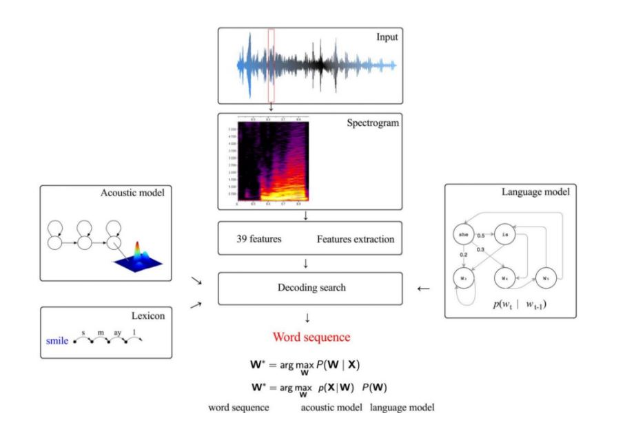

# Why do we need ASR

Speech recognition technology allows computers to take spoken audio, interpret it and generate text from it. 
But how do computers understand human speech? The short answer is…the wonder of signal processing. Speech 
is simply a series of sound waves created by our vocal chords when they cause air to vibrate around them.
These sound waves are recorded by a microphone, and then converted into an electrical signal. The signal 
is then processed using advanced signal processing technologies, isolating syllables and words. Over time, the computer can learn to understand speech from experience, thanks to incredible recent advances in artificial intelligence and machine learning. But signal processing is what makes it all possible.

# Hello World of ASR

ASR or Automatic Speech Recognition is a process which takes a continuous audio speech signal
and converts it into it's equivalent text. This is an introductory blog around the process of performing ASR
using the workflow to implement it in a kaldi environment.

What we need:

* Lots of audio files
* All their corresponding transcripts

(Specific to Audio Input) Factors that impact a good ASR engine are:

* Volume
* Number of speakers
* Pitch
* Silences
* Word sped
* Background Noise

# What we need to know to understand ASR:

* Bayes Theorem
* HMM
* GMM
* Basic language and phone understanding

# What do we need to create an ASR Engine 

In kaldi the workflow used to build an ASR engine is, an Acoustic model, a Language model and Lexicon model.
The acoustic model would help us understand the audio signal, whereas the language model would help us predict the
next word in a sequence. The lexicon model is a pronunciation model.

The primary objective of speech recognition is to build a statistical model to infer the text sequences 
(say “cat sits on a mat”) from a sequence of feature vectors.

There is some golden content to be found in phonetics and linguistics, but regardless ASR is about finding the most 
likely word sequence given an audio and train these probability models with the provided transcripts.

The basic idea around building an ASR engine would revolve around understanding the speech signal. We need to 
represent the audio file (.wav or .flac) into it's corresponding audio signal and extract features from it. That
would involve applying a series of mathematical operations to extract features. MFCC analysis or Mel Frequency Cepstrum 
Coefficient Analysis is the conversion of that audio signal to the essential speech features required to train an 
acoustic model. A spectrogram is the conversion of an audio signal into the frequency domain using the fourier transform. 

In ASR, understanding how we hear is more valuable than understanding how we speak in feature extraction.

# Acoustic, Lexicon & Language Model:

